# MoAir.ug - Mobile Money CSV Converter

<div align="center">

 <!-- Add your logo here -->

**Convert MTN Mobile Money and Airtel Money statements to clean CSV files in seconds**

[](https://moair.ug)
[](https://github.com/gideon-tech/mobile-money-csv)
[](LICENSE)

*Trusted by 1000+ Uganda businesses for automated bookkeeping*

</div>

---

## 🎯 **What is MoAir?**

**MoAir** is Uganda's first automated mobile money statement converter. Transform messy PDF statements from MTN Mobile Money and Airtel Money into clean, Excel-ready CSV files instantly.

### ⚡ **Save 10+ Hours Monthly**
- **Manual data entry**: 2-3 hours per statement
- **With MoAir**: 30 seconds per statement
- **ROI**: 10,000%+ time savings for accountants and business owners

---

## 📸 **Screenshots**

### 🏠 **Homepage - Drag & Drop Interface**
*[Screenshot of main upload interface with MTN/Airtel logos]*


### 📊 **Conversion Results**
*[Screenshot showing before/after: PDF → Clean CSV]*


### 📈 **Dashboard (Pro Users)**
*[Screenshot of user dashboard with usage analytics]*


---

## 🚀 **Features**

### 🆓 **Free Tier**
- ✅ **5 conversions per month**
- ✅ **MTN Mobile Money** support
- ✅ **Airtel Money** support
- ✅ **Clean CSV export**
- ✅ **No credit card required**

### 💎 **Pro Tier ($15/month)**
- ✅ **Unlimited conversions**
- ✅ **Priority support**
- ✅ **Advanced analytics** *(coming soon)*
- ✅ **Bulk processing** *(coming soon)*
- ✅ **Custom CSV templates** *(coming soon)*

### 🏢 **Enterprise**
- ✅ **Multi-business management**
- ✅ **API access**
- ✅ **White-label options**
- ✅ **Custom integrations**
- 📞 [Contact us](https://moair.ug/contact) for pricing

---

## 🛠️ **How It Works**

```mermaid
graph LR
    A[📱 Upload PDF] --> B[🔍 Auto-Detect Provider]
    B --> C[⚡ Parse Transactions]
    C --> D[📊 Generate CSV]
    D --> E[💾 Download Clean Data]
    
    style A fill:#e1f5fe
    style B fill:#f3e5f5
    style C fill:#e8f5e8
    style D fill:#fff3e0
    style E fill:#fce4ec
```



### 📝 **Step-by-Step Process**

1. **📂 Upload**: Drag and drop your MTN or Airtel PDF statement
2. **🎯 Select Provider**: Choose MTN Mobile Money or Airtel Money
3. **⚡ Convert**: Our AI instantly parses transactions
4. **📊 Review**: Preview extracted data before download
5. **💾 Export**: Download clean CSV ready for Excel/QuickBooks

---

## 🎯 **Perfect For**

<table>
  <tr>
    <td align="center">
      <br/>
      <b>🧮 Accountants</b><br/>
      <em>Eliminate manual data entry</em>
    </td>
    <td align="center">
      <br/>
      <b>🏪 Small Businesses</b><br/>
      <em>Automate bookkeeping</em>
    </td>
    <td align="center">
      <br/>
      <b>📋 Auditors</b><br/>
      <em>Clean transaction records</em>
    </td>
    <td align="center">
      <br/>
      <b>🏦 MFIs/Banks</b><br/>
      <em>Customer data processing</em>
    </td>
  </tr>
</table>

---

## 📈 **Business Impact**

### 💰 **ROI Calculator**
```
📊 Typical Accountant:
• 15 clients × 2 statements/month = 30 statements
• Manual processing: 2 hours/statement = 60 hours/month
• Billing rate: UGX 25,000/hour = UGX 1,500,000/month lost
• MoAir cost: UGX 56,250/month
• NET SAVINGS: UGX 1,443,750/month (2,556% ROI!)
```

### 🎯 **Customer Success Stories**
> *"MoAir saved our accounting firm 40 hours per month. We can now serve 3x more clients!"*  
> — **Sarah K.**, CPA, Kampala

> *"From 3 hours to 3 minutes per statement. This is a game changer!"*  
> — **David M.**, Restaurant Owner, Entebbe

---

## 🔧 **Tech Stack**

<div align="center">

| Frontend | Backend | Database | Auth | Deployment |
|----------|---------|----------|------|------------|
|  |  |  |  |  |

</div>

### 🛠️ **Built With**
- **Frontend**: Next.js 15, React, TypeScript, Tailwind CSS
- **Backend**: Next.js API Routes, PDF parsing, CSV generation
- **Database**: Supabase (PostgreSQL)
- **Authentication**: Clerk Auth
- **Deployment**: Vercel
- **Styling**: Tailwind CSS, Lucide Icons

---

## 🚀 **Quick Start**

### 🌟 **For Users**
1. **Visit**: [moair.ug](https://moair.ug)
2. **Sign Up**: Free account (no credit card)
3. **Upload**: Your MTN/Airtel PDF statement
4. **Convert**: Get clean CSV in seconds
5. **Enjoy**: 5 free conversions every month!

### 👨‍💻 **For Developers**

```bash
# Clone repository
git clone https://github.com/gideon-tech/mobile-money-csv.git
cd mobile-money-csv

# Install dependencies
npm install

# Set environment variables
cp .env.example .env.local
# Add your Clerk and Supabase keys

# Run development server
npm run dev
# Open http://localhost:3000
```

### 📋 **Environment Variables**
```env
# Clerk Authentication
NEXT_PUBLIC_CLERK_PUBLISHABLE_KEY=pk_test_...
CLERK_SECRET_KEY=sk_test_...

# Supabase Database
NEXT_PUBLIC_SUPABASE_URL=https://...
SUPABASE_SERVICE_ROLE_KEY=...
```

---

## 📊 **API Documentation**

### 🔄 **Convert Endpoint**
```typescript
POST /api/convert

// Request
Content-Type: multipart/form-data
- file: PDF file
- provider: "MTN" | "Airtel"

// Response
Content-Type: text/csv
- Clean CSV data
- X-Transaction-Count header
```

### 📈 **Usage Analytics**
```typescript
// Check monthly usage
GET /api/usage
Authorization: Bearer {clerk_token}

// Response
{
  "used": 3,
  "limit": 5,
  "plan": "free"
}
```

---

## 🌍 **Supported Providers**

<div align="center">

| Provider | Status | Features |
|----------|---------|----------|
|  **MTN Mobile Money** | ✅ **Full Support** | All transaction types, fees, balances |
|  **Airtel Money** | ✅ **Full Support** | All transaction types, fees, balances |
| **Centenary Bank** | 🚧 **Coming Soon** | API integration planned |
| **Stanbic Bank** | 🔮 **Planned** | Q2 2026 |

</div>

### 📋 **Supported Transaction Types**
- ✅ Send Money
- ✅ Receive Money  
- ✅ Cash Withdrawal
- ✅ Cash Deposit
- ✅ Pay Bills (UMEME, NWSC, DStv, etc.)
- ✅ Buy Airtime
- ✅ Merchant Payments
- ✅ Balance Inquiries

---

## 📈 **Roadmap**

### 🎯 **Q1 2026**
- [x] MVP Launch (MTN + Airtel)
- [x] User authentication
- [x] Freemium model
- [ ] Mobile app (iOS/Android)
- [ ] Bulk processing

### 🚀 **Q2 2026**
- [ ] Advanced analytics dashboard
- [ ] Bank statement support
- [ ] API for accounting software
- [ ] Kenya market expansion

### 🌟 **Q3 2026**
- [ ] Enterprise features
- [ ] White-label solutions
- [ ] Tanzania market entry
- [ ] AI-powered insights

---

## 🤝 **Contributing**

We welcome contributions from the community! 

### 🔧 **Development Setup**
```bash
# Fork the repository
# Clone your fork
# Create feature branch
git checkout -b feature/amazing-feature

# Make changes
# Test thoroughly
npm test

# Commit changes
git commit -m "Add amazing feature"

# Push to branch
git push origin feature/amazing-feature

# Open Pull Request
```

### 📋 **Contribution Guidelines**
- Follow TypeScript best practices
- Add tests for new features
- Update documentation
- Follow commit message conventions

---

## 📞 **Support**

### 🆘 **Need Help?**
- 📧 **Email**: support@moair.ug
- 💬 **WhatsApp**: +256 XXX XXX XXX
- 🌐 **Website**: [moair.ug/contact](https://moair.ug/contact)
- 📱 **Telegram**: @moairuganda

### 🐛 **Found a Bug?**
[Report issues on GitHub](https://github.com/gideon-tech/mobile-money-csv/issues)

### 💡 **Feature Request?**
[Submit feature requests](https://github.com/gideon-tech/mobile-money-csv/discussions)

---

## 📜 **License**

This project is licensed under the **MIT License** - see the [LICENSE](LICENSE) file for details.

---

## 🏆 **Recognition**

<div align="center">

[](https://www.producthunt.com/posts/moair)
[](https://ugandatechawards.com)

</div>

### 🎉 **Awards & Features**
- 🏆 **Uganda Tech Awards 2026** - Best Fintech Innovation
- 📰 **Daily Monitor** - Featured Startup
- 🎯 **Product Hunt** - Product of the Day
- 📺 **NTV Uganda** - Tech Interview

---

## 🔗 **Links**

<div align="center">

[](https://moair.ug)
[](https://twitter.com/moairuganda)
[](https://linkedin.com/company/moair)
[](https://instagram.com/moairuganda)

</div>

---

<div align="center">

**Made with ❤️ in Uganda 🇺🇬**

*Transforming mobile money data, one conversion at a time*

[](https://github.com/gideon-tech/mobile-money-csv)

</div>